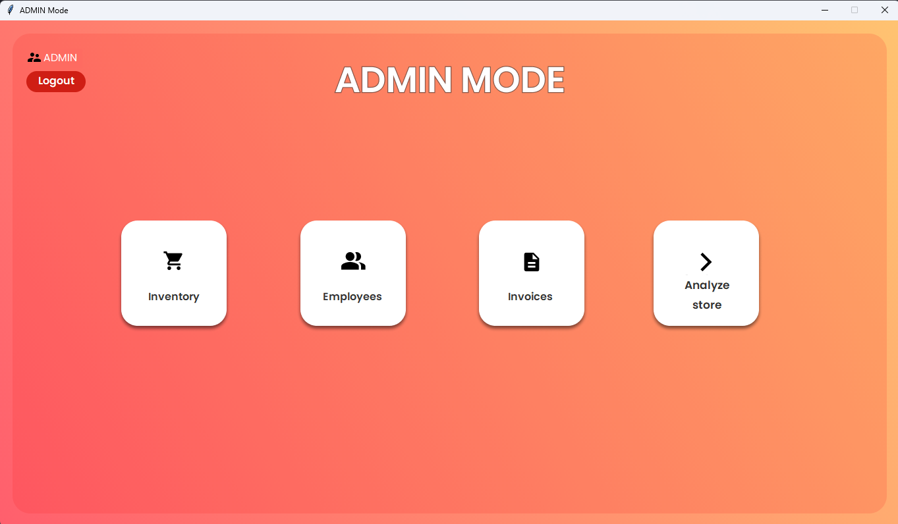
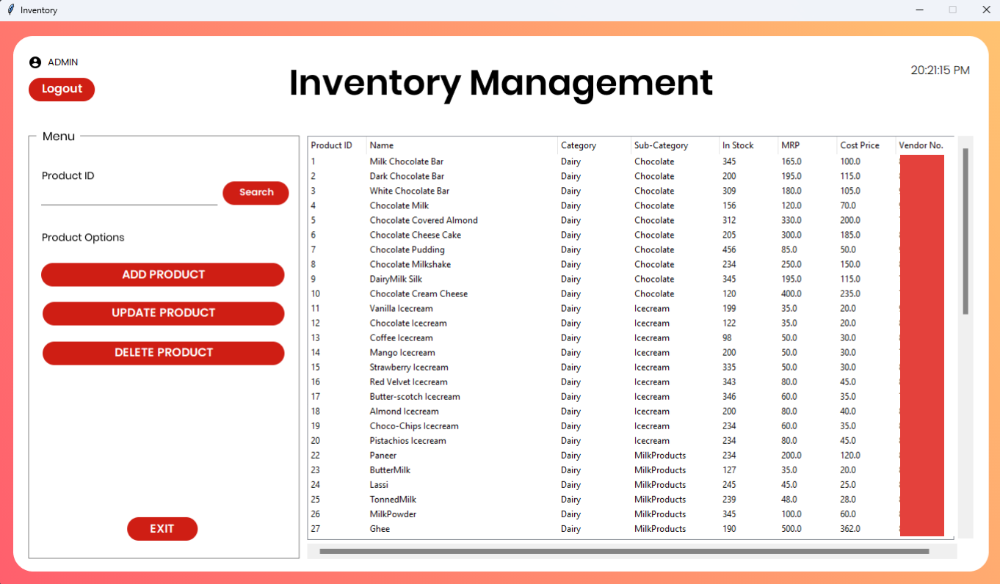
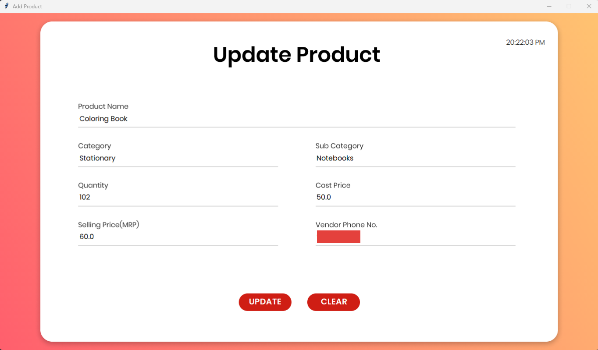
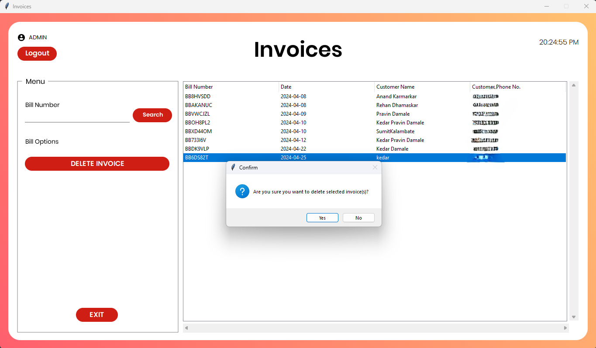

# GroceryShopONE

Welcome to the <b>GroceryShopONE</b>! This Python-based application features two distinct dashboards—one for admins and one for employees. It provides a comprehensive set of tools for managing a grocery store, including inventory management, employee management, billing, and data analysis.

## Features

### Admin Dashboard

<ul>
    <li><b>Login:</b> Secure admin login to access the dashboard.</li>
    <li><b>Grocery Management:</b> 
        <ul>
            <li>Add new grocery items.</li>
            <li>Update existing inventory.</li>
            <li>Delete inventory items.</li>
        </ul>
    </li>
    <li><b>Employee Management:</b>
        <ul>
            <li>Add new employees.</li>
            <li>Update employee details.</li>
            <li>Delete employees.</li>
        </ul>
    </li>
    <li><b>Bills Management:</b>
        <ul>
            <li>View detailed bills.</li>
            <li>Delete bills.</li>
        </ul>
    </li>
    <li><b>Analyze Store:</b> 
        <ul>
            <li>Projects store data onto a Flask web server.</li>
            <li>Displays data on a website for analysis.</li>
        </ul>
    </li>
</ul>

### Employee Dashboard

<ul>
    <li><b>Invoice Generator:</b>
        <ul>
            <li>Generates detailed invoices based on customer purchases.</li>
            <li>Takes input for items bought and produces formatted invoices.</li>
        </ul>
    </li>
</ul>

 
 
 

# Preview of the Features

### Main Login

The initial login screen allows users to choose between the Admin and Employee dashboards.

### Admin Login

After selecting the Admin option, the login window for the admin dashboard appears.

### Admin Dashboard

Once logged in, the Admin Dashboard provides access to various management functions.

### Grocery Management

- **Inventory Display:**
  

- **Search Inventory:**
  

- **Add Inventory:**
  

- **Update Inventory:**
  

- **Delete Inventory:**
  

### Employee Management

- **Display and Search Employee:**
  

- **Update Employee:**
  

- **Delete Employee:**
  

### Bills Management

- **View Bills:**
  

- **Display Bills:**
  

- **Delete Bills:**
  

### Analyze Store

The Analyze Store function projects data from the store onto a Flask web server and displays it on a website.

### Employee Dashboard

After logging into the Employee Dashboard, the billing system is accessible for generating invoices.

### Invoice Generator

- **Generate Invoice:**
  

## Thank You

Thank you for checking out the Grocery Store App! Your feedback and contributions are highly appreciated. If you have any questions or suggestions, feel free to open an issue or reach out.

---
